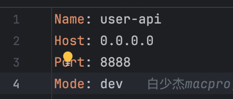

# 技术架构和配置说明

## 1. 技术架构

1. Postgres 集群监控: Pigsty
2. 开发工具:
    - modd: 用于热加载
    - Delve: 用于调试
3. Redis (待定): 可能会使用 Pika 作为替代

## 2. 目录架构

关于 model 可以放到 rpc 的目录 internal 目录中，这样 api 就只能通过 rpc->model
- 优点: 防止 API 和 model 耦合
- 缺点: 灵活性有所降低

## 3. Postgres 配置

context 文件需要导入驱动：

```go
_ "github.com/jackc/pgx/v5/stdlib"
```

然后执行：

```shell
go mod tidy
```

相关文件：
- [service_context.go](app/user_center/cmd/api/internal/svc/service_context.go)
- [user-api.yaml](app/user_center/cmd/api/etc/user-api.yaml)

## 4. 并发测试

```shell
# go install github.com/rakyll/hey@latest
# 我们用 hey 工具来进行压测，压测 90 个并发，执行 1 秒
hey -z 1s -c 90 -q 100 'http://localhost:8887/v1/user-center/user?id=1'
```

## 5. 监控

### Grafana 监控

- Grafana: http://127.0.0.1:3001/  ， 默认账号、密码都是 admin
- go-zero 指标: https://go-zero.dev/docs/tutorials/monitor/index
- 依赖于 prometheus

监控页面常用的监控指标 (prometheus.yml):

```yaml
histogram_quantile(0.5, sum(rate(redis_client_requests_duration_ms_bucket[$rate_interval])) by (le))
```

```yaml
histogram_quantile(0.95, sum by (le) (rate(redis_client_requests_duration_ms_bucket{app="user_center-api"}[$__rate_interval])))
histogram_quantile(0.95, sum by (le) (rate(redis_client_requests_duration_ms_bucket{app="user_center-api"}[5m])))
```

Prometheus 配置:

```yaml
  - job_name: 'user_center-api'
    static_configs:
      # 注意是容器服务名,不是容器名,右侧是在对应服务中的yaml文件中配置的
      - targets: [ 'api:4001' ]
        labels:
          job: user_center-api
          app: user_center-api
          env: dev
```

服务配置:

```yaml
#监控
Prometheus:
  Host: 0.0.0.0
  Port: 4001
  Path: /metrics
```

## 6. Docker

### 重新构建

发布环境注意重新构建 [ROCKER-REBUILD.md](ROCKER-REBUILD.md)

### 不同服务的 dockerfile 以及 go.mod

不同服务的目录下放不同的 go.mod，这样有些服务不需要的依赖包就不会被下载

### 生成 dockerfile

使用脚本 [dockerfile_build_user_center.sh](deploy/script/shell/dockerfile_build_user_center.sh)  
生成 dockerfile 使用的是 1.7.1 未发布版本 [goctl](deploy/goctl/1.7.1/goctl)  
在 go.mod 目录中执行!!! (shell 已经有到 go.mod)

### 1.7.1 goctl 自行修改的内容

自行修正了并生成的可执行文件  
解决不同目录下执行生成 dockerfile 文件中没有找到对应 etc 目录，如果使用官方的无法找到 etc 目录无法找到 yml 配置文件
copy 对应的目录也不对

[Dockerfile](app/user_center/Dockerfile) 示例:

```dockerfile
# 检查后面的目录,是 doccker-compose context的目录 下的目录
RUN go build -ldflags="-s -w" -o /app/user cmd/api/user.go

# 左侧的路径是 go.mod 文件的相对路径 右侧是容器中的etc目录
COPY cmd/api/etc /app/etc
COPY --from=builder /app/etc /app/etc
# 启动命令 以容器中的配置文件启动的,目录是容器内的目录
CMD ["./user", "-f", "etc/user-api.yaml"]
```

## 7. go-zero 生成代码的模板文件

暂时采用 goctl 1.7.1 版本
goctl 可执行文件是根据官方 master 分支修改的，已经是 1.7.1 版本了，虽然 go.mod 是 1.7.0 的版本，但是生成的 dockerfile 是 1.7.1 的版本，所以可以不用修改
但是这里先采用 1.7.1 版本，此框架代码写时 1.7.1 版本还未发布
牵扯文件: [gen_api.sh](deploy/script/gencode/gen_api/gen_api.sh)

## 8. 环境

### 开发环境
go.work 解决了go.mod 文件中多个 module 的问题,每个服务下的go.mod 文件与根目录下的go.mod 文件不冲突了就.
优点:
    1. 每个服务单独的 go.mod 文件,不影响其他服务
    2. 根目录下的 go.mod 文件，作为开发时使用
[go.work](go.work)

```shell
# 启动执行  指定 docker-compose-dev.yml
docker compose -f docker-compose-dev.yml up
# 停止 
docker compose -f docker-compose-dev.yml down
# 重新build 不使用缓存
docker compose -f docker-compose-dev.yml build --no-cache
```

### 线上环境
注意服务下的配置文件中 mode 要修改为 pro

```shell
#删除
docker compose down
docker compose rm -s api
## 重新build 不使用缓存
docker compose build --no-cache
docker compose build api --no-cache
# 启动
docker compose up -d   
docker compose stop   
```

## 9. 链路追踪

浏览器输入 [web浏览器查看地址](http://127.0.0.1:16686/search) 即可查看
依赖于 elasticsearch 做存储

docker-compose.yml 配置:

```yaml
  #jaeger链路追踪 — Jaeger for tracing 依赖 elasticsearch(做存储)
  jaeger:
    image: jaegertracing/all-in-one:1.42.0
    container_name: ${APP_NAME}_jaeger
    restart: always
    ports:
      - "5775:5775/udp"
      - "6831:6831/udp"
      - "6832:6832/udp"
      - "5778:5778"
      - "16686:16686"
      - "14268:14268"
      - "9411:9411"
    environment:
      - SPAN_STORAGE_TYPE=elasticsearch
      - ES_SERVER_URLS=http://elasticsearch:9200
      - LOG_LEVEL=debug
    networks:
      - looklook_net
```

只需要在某个服务的配置文件 .yml 中增加以下配置即可:

```yaml
#链路追踪
Telemetry:
  # 只需要配置服务名字即可,其他不动
  Name: user_center_api
  Endpoint: http://jaeger:14268/api/traces
  Sampler: 1.0
  Batcher: jaeger
```

## 10. Elasticsearch 做存储

- clickhouse 是替代品
- elasticsearch 作用: 全文搜索引擎，提供日志查询，作为链路追踪的存储，prometheus 的存储

## 待办事项
不使用 redis/postgres? 在启动服务不会立刻报错.只有发生请求后才会报错?? user.go 中

- Postgres 集群监控 Pigsty
  [哔哩哔哩视频链接](https://www.bilibili.com/video/BV13q4y1o74M/?spm_id_from=333.880.my_history.page.click&vd_source=ca29f7158bd0ff443c7d38352c028de4)